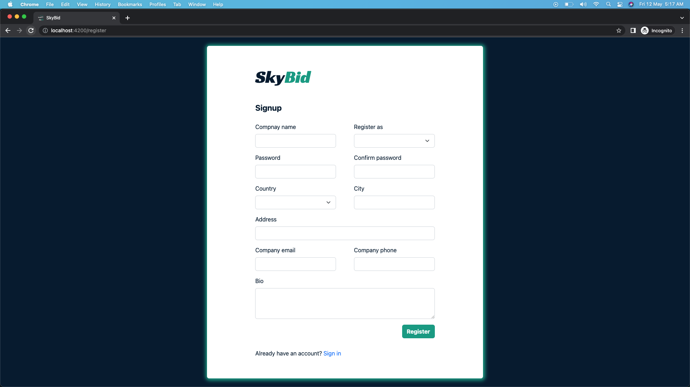

<br><br>

<!-- project philosophy -->


> A web app that provides solutions for private jet charter operators and brokers, and enables them to stay ahead of the competition by leveraging real-time market demand
>
> SkyBid seeks to revolutionize the private jet charter industry by offering a seamless, user-friendly platform that enables operators and brokers to engage in real-time bidding for charter flights. Our mission is to optimize the booking experience, save time, and ensure the utmost satisfaction for all parties involved in the private aviation sector..

### User Stories

- As a user I want to be able to contact other users so that i can negotiate in private conversations.
- As a broker I want to create a new request so that I can find flights with best prices.
- As a broker I want to accept a bid in order to secure the best price for my client and book the desired flight.
- As an operator I want to submit a bid in real-time so that I can maximize my chances of winning the booking.

### Admin Stories

- As an admin I want to monitor the number of users so that i can identify any issues or areas for improvement.
- As an admin I want to be able to see the user details so that I can ensure compliance with platform policies.

<br><br>

<!-- Prototyping -->


> We designed SkyBid using wireframes and mockups, iterating on the design until we reached the ideal layout for easy navigation and a seamless user experience.

### Wireframes
| Login screen  | Requests screen | Create request screen | Aircrafts screen | 
| --- | --- | --- | --- | 
|  |  |  |  |


### Mockups
| Login screen | Requests screen | Create request screen | Messages screen  |
| ---| --- | --- | ---| 
|  |  | |  |


<br><br>

<!-- Implementation -->


> Using the wireframes and mockups as a guide, we implemented the SkyBid app with the following features:

### SkyBid in Action
| Landing screen | Aircrafts |
| ---| ---| 
| |  
|Create request | Chat
| |  

### User Screens
| Landing screen | Landing screen 
| ---| ---| 
|  |  
| Landing screen | Landing screen |
|  | 
| Landing screen | Register screen | 
|  | 
| Login screen | Edit profile screen 
|  |  
| Requests broker screen | Request operator screen
|  | 
| Create request screen | Bids screen 
|  | 
| Accept bid screen | Send message screen 
|  |   
| Messages screen | Chat screen
|  | 
| Aircrafts screen | Add-aircraft screen
|  | 
| Request details screen | Add-bid screen 
|  | 

### Admin Screens
| Dashboard screen | Users screen |
| ---| ---|
|  |  |


<br><br>

<!-- Tech stack -->


###  SkyBid is built using the following technologies:

- This project uses the [Angular app development framework](https://angular.io/). Angular is a dynamic framework that crafts interactive user interfaces, ensuring seamless and responsive interactions across various devices.
- The app uses [MongoDB](https://www.mongodb.com/) a flexible NoSQL database for efficient data storage and retrieval, empowering the application to effectively scale and manage data.
- [Node.js](https://node.js.org/): A runtime environment executing JavaScript server-side, enabling the development of scalable, high-performance web applications.
- [Express.js](https://expressjs.com/): A lightweight, adaptable web application framework that streamlines Node.js server creation and effortlessly manages backend communication.
- [Socket.IO](https://socket.io/): A real-time bidirectional event-based communication library, facilitating live data updates between operators and brokers.

- The app uses the font ["Roboto"](https://fonts.google.com/specimen/Roboto) as its main font, and the design of the app adheres to the material design guidelines.

<br><br>

<!-- How to run -->


> To set up SkyBid locally, follow these steps:

### Prerequisites

This is an example of how to list things you need to use the software and how to install them.
* npm
  ```sh
  npm install npm@latest -g
  ```

### Installation

_Below is an example of how you can instruct your audience on installing and setting up your app. This template doesn't rely on any external dependencies or services._

1. Clone the repo
   ```sh
   git clone https://github.com/fady-dib/SkyBid.git
   ```
2. Navigate to the backend folder
   ```sh
   cd skybid-server
   ```
3. Install the backend NPM packages:
   ```sh
   npm install
   ```   
4. Create .env file in the root directory of skybid-server folder and add the following lines. Remember to replace the placeholders with your actual values.
   ```sh
   PORT = number
   DB_URL = your database
   SECRET_KEY = your secret key
   ```   
5. To start the backend server, run the following command in the terminal. Make sure you're in the root directory of your project:
   ```sh
   nodemon .
   ```   
6. Open a new terminal and navigate to the frontend folder   
   ```sh
   cd skybid-frontend
   ```    
7. Install the frontend NPM packages
   ```sh
   npm install
   ```     
8. To start the frontend of the application, run the following command
   ```sh
   ng serve
   ``` 
   
Now, you should be able to run SkyBid locally and explore its features.
